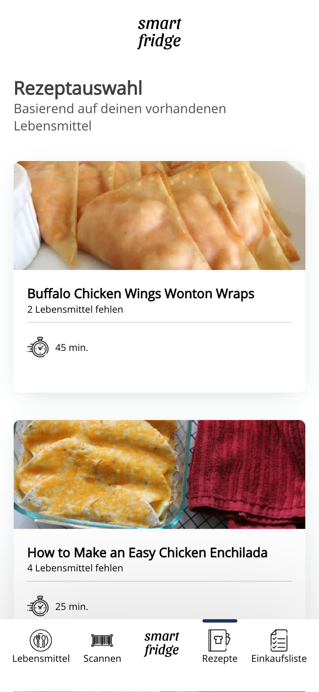

# Smart Fridge

This application can search for recipes based on the foods you have.

## Application setup


#### Frontend (VueJS)
The Frontend handles the user input and output. It is built by VueJs to get fast results by implementing the ui.

#### Backend (Quarkus)
Quarkus uses a lightweight java jdk called "GraalVM" which helps to reduce application startup time and resource consumption.
See https://quarkus.io/ for more information.

The backend have multiple REST endpoints for example to handle the fridge content or calling the external recipe api to get possible recipes based on the fridges content.

#### Used Recipe API
I used spoonacular.com because it´s free for some requests a day and works like expected to what I wanted. 
The API can handle ingredients input to search recipes which includes these ingredients. 
If some recipes contains also other not included ingredients it is also given in the response.

## Features Ideas
* If there are missed ingredients for an recipe call a local market store with the missed ingredients and checkout to get the missed ingredients soon.
* Translation (or use a API which can translate or is driven by a german company. Unfortunately chefkoch.de has no api)
* Reminder to notify for foods which expires soon

## Build setup
### Docker build
```
Build docker image
$ docker build -f src/main/docker/Dockerfile.multistage -t smart-fridge:latest .
```

## Startup guide
```
Starting in dev mode
$ mvn quarkus:dev

If you already built the docker image you can run it by
$ docker run -i --rm -p 8080:8080 smart-fridge:latest

You have to run the mongo database additionaly
$ docker-compose up -d
```

## Some demo images


